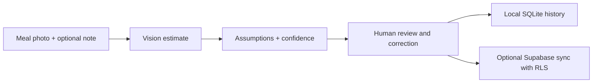

# MacroLens

[](https://github.com/kyle-matthies/nutrition-photo-macro-tracker/actions/workflows/ci.yml)
[](LICENSE)
[](https://www.python.org/)

MacroLens turns a meal photo into a **rough, reviewable macro estimate**. It is designed around a simple truth: image models can recognize food, but portions, cooking fats, sauces, and hidden ingredients remain uncertain.

The app therefore makes the human review step part of the product rather than hiding it:

1. Upload a meal photo and add optional context.
2. Generate a structured calorie, protein, carbohydrate, and fat estimate.
3. See assumptions and separate identity, portion, and nutrition confidence.
4. Correct the estimate before saving it.
5. Keep history locally, with optional per-user Supabase sync.

> [!IMPORTANT]
> MacroLens is an educational tracking tool, not a medical device. Estimates can be materially wrong and should not be used for diagnosis, treatment, medication, or urgent health decisions.

## Why this project exists

Most photo nutrition demos optimize for the reveal: upload an image and receive a precise-looking number. MacroLens optimizes for the correction loop. It preserves uncertainty, asks for context when the image is weak evidence, and never stores the raw photo in Supabase by default.



## Quick start

Prerequisites: Python 3.11+, [uv](https://docs.astral.sh/uv/), and an OpenAI API key.

```bash
git clone https://github.com/kyle-matthies/nutrition-photo-macro-tracker.git
cd nutrition-photo-macro-tracker
cp .env.example .env
# Add OPENAI_API_KEY to .env
uv sync --all-groups
uv run streamlit run app.py
```

To explore the interface without making API calls, set `MACRO_LENS_DEMO=1`. Demo results are visibly labeled and are not image analysis.

## Optional Supabase setup

MacroLens works locally without Supabase. To add private cloud history:

1. Create a Supabase project and enable email/password authentication.
2. Apply the included migration:

   ```bash
   supabase link --project-ref YOUR_PROJECT_REF
   supabase db push
   ```

3. Set `SUPABASE_URL` and `SUPABASE_PUBLISHABLE_KEY` in `.env`.
4. Create a user, then sign in from the app sidebar.

The migration enables RLS and limits every read/write policy to `auth.uid() = user_id`. It explicitly grants Data API access to the authenticated role because newer Supabase projects do not necessarily expose new tables automatically. Depending on your project's Data API settings, you may also need to expose the `public` schema in the dashboard.

Raw meal photos are sent to the configured vision provider for analysis but are held only in the running app session. They are not written to SQLite or Supabase. Saved records include the reviewed macro estimate, confidence, assumptions, optional note, timestamps, and the model name.

## Architecture

- `app.py` — Streamlit upload, review, save, and history workflow.
- `src/macro_lens/analyzer.py` — image validation and structured model output.
- `src/macro_lens/models.py` — validated estimate and persisted record contracts.
- `src/macro_lens/storage.py` — local SQLite and optional authenticated Supabase adapters.
- `supabase/migrations/` — schema, grants, indexes, and ownership RLS policies.
- `tests/` — model, analyzer-contract, storage, and privacy-boundary tests.

See [product decisions](docs/product-decisions.md), [privacy and threat model](docs/privacy-and-threat-model.md), and the [data dictionary](docs/data-dictionary.md) for the reasoning behind the implementation.

## Project status

MacroLens is an alpha reference implementation. The core workflow is complete; next priorities are correction-quality analytics, label-specific OCR, provider adapters, and an opt-in encrypted image-evidence workflow.

## Contributing

Issues and pull requests are welcome. Read [CONTRIBUTING.md](CONTRIBUTING.md) and [SECURITY.md](SECURITY.md) first. Please use synthetic fixtures only—never submit a real meal photo, health record, credential, or production database.

## License

[MIT](LICENSE) © 2026 Kyle Matthies
